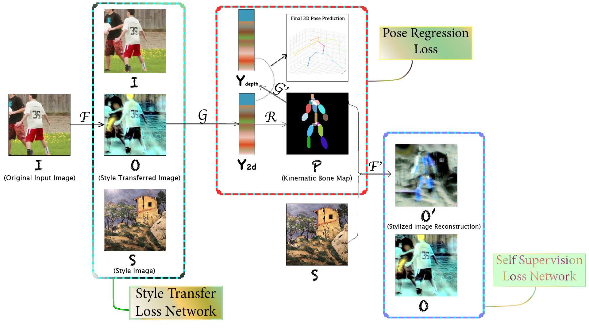
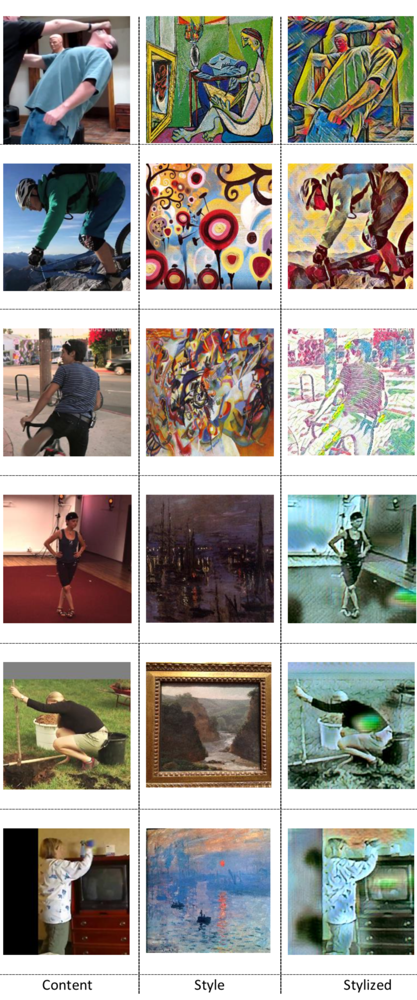
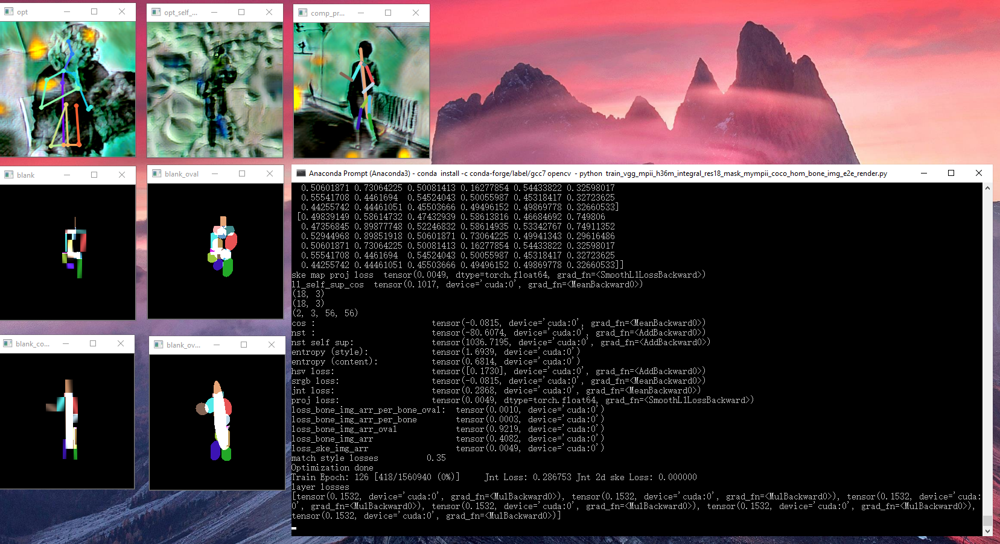

# NAPA-NST-HPE
This is the coursework project page for "Computer Vision - CSCI-GA.2271-001" Fall 2020 (https://cs.nyu.edu/~fergus/teaching/vision/index.html) at NYU Courant.
 
Implementation of "NAPA: Neural Art Human Pose Amplifier".

Some incomplete preliminary theoretical foundations (*motivations* / *analysis*) can be found in the **Appendix** section of the pdf report. Note this only provides some insights into the choices made as well as the components involved. Please refer to 1. the code 2. the experiments in the main body for a thorough understanding.

----

<p align="center">  
  
</p> 

----

## Main Results

### Pose Predictions

### Stylized Results

We show style transferred images on MPII below. For more output of style-specific models (recall the separate training), go to [this link](https://github.com/strawberryfg/NAPA-NST-HPE/tree/main/train/per-style-training).

----

<p align="center">  
  
</p>
 
----

## Demo (Testing)

----

## Environment

----

GPU cards: GTX 1070, RTX 2080, Google Colab GPUs.

Environment: Unix + Windows (Alienware 15 R3).

Tools: Anaconda 3, Microsoft Visual Studio 2013 & 2019.

Deep learning framework: PyTorch 1.6.0

Languages: Python, C++ and C#.


----

## Training

Follow the steps *missing*, you will get something like this:

<p align="center">  
  
</p> 

----

## Data 

The data is on [Google Drive](https://drive.google.com/drive/folders/1omDWZeG6zA8GJx5Ij9Y1qJZiY8YYTcFx?usp=sharing). 

The structure:

``` shell
${DATA_ROOT}
|-- datasets
`-- |-- allstyles
    |   |   |   | ### All the artistic style images (277 in total)
`-- |-- per_style_training_styles
    |   |   |   | ### Style targets for the per-style training experiment
`-- |-- stylized_mpii ### Per-style training output (1 trained pose model for 1 style)
    `-- |-- candy_jpg
    `-- |-- composition_vii_jpg
    `-- |-- feathers_jpg
    `-- |-- la_muse_jpg
    `-- |-- mosaic_jpg
    `-- |-- starry_night_crop_jpg
    `-- |-- the_scream_jpg
    `-- |-- udnie_jpg
    `-- |-- wave_crop_jpg
`-- |-- h36m
    `-- |-- s_01_act_02_subact_01_ca_01
    |   |   |   | ### subject (s): 01, 05, 06, 07, 08, 09, 11
    |   |   |   | ### action (act): 01, 02, ..., 16
    |   |   |   | ### subaction (subact): 01, 02
    |   |   |   | ### camera (ca): 01, 02
    |   |   | ### Please refer to "https://github.com/mks0601/Integral-Human-Pose-Regression-for-3D-Human-Pose-Estimation" for details
`-- |-- mpii
    `-- |-- annotations
    `-- |-- images
    |   |   | ### For the above two folders please refer to "https://github.com/mks0601/Integral-Human-Pose-Regression-for-3D-Human-Pose-Estimation" for details
    `-- |-- img
    |   |   |   | ### Cropped images for pseudo 3D ground truth annotation
    `-- |-- gt_joint_3d_train_all.txt
    |   |   |   | ### Pseudo 3D ground truth of MPIi
`-- |-- testset

```

----

## Annotation

Check out the demo videos for annotation tools [here](https://github.com/strawberryfg/NAPA-NST-HPE/tree/main/annotation_tools/art_img_annotator) and [here](https://github.com/strawberryfg/NAPA-NST-HPE/tree/main/annotation_tools/mpii_annotator).