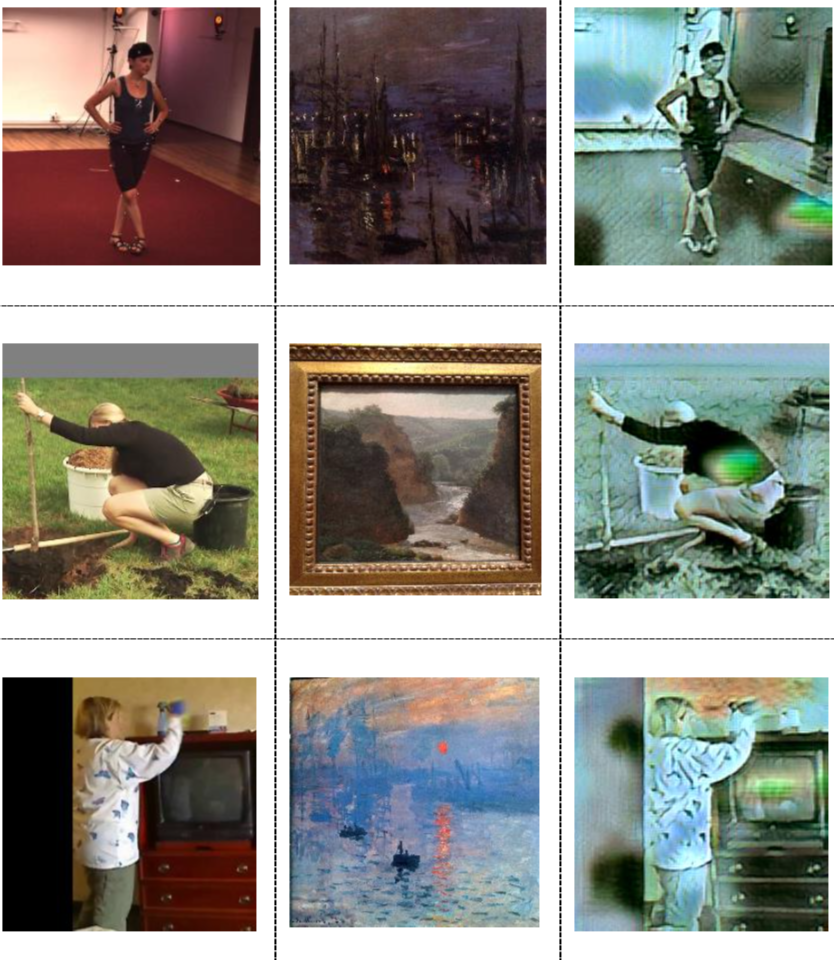

# NAPA-NST-HPE
This is the coursework project page for "Computer Vision - CSCI-GA.2271-001" Fall 2020 (https://cs.nyu.edu/~fergus/teaching/vision/index.html) at NYU Courant.
 
Implementation of "NAPA: Neural Art Human Pose Amplifier".

**[Remark]**
Some incomplete preliminary theoretical foundations (*motivations* / *analysis*) can be found in the **Appendix** section of the pdf report, where we try to dissect through the lens of topological spaces. Note this only provides some insights into the choices made as well as the components involved. Please refer to 1. the code 2. the experiments in the main body for a thorough understanding.

----

<p align="center">  
  
</p> 

----

## Main Results

Upon first look:

<p align="center">  
  
</p>


### Pose Predictions


----

<p align="center">  
  
</p>
 
----


### Stylized Results

We show style transferred images on MPII below. For more output of style-specific models (recall the separate training), go to [this link](https://github.com/strawberryfg/NAPA-NST-HPE/tree/main/train/per-style-training).

----


<p align="center">  
  
</p>


<p align="center">  
  
</p>
 
 


<p align="center">  
  
</p>
 
----

## Demo (Testing)


<p align="center">  
  
</p> 


Put data under ```testset/```, download weights from ```pretrained_weights```, and follow [here](https://github.com/strawberryfg/NAPA-NST-HPE/tree/main/test).
It's a simple process of loading weights and saving 

```
1. Overlaid 2d on test image. 
```

```
2. Predicted 2d joint coordinates.
```

```
3. Predicted 3d joint coordinates and the Python figures.
```

----

## Environment

----

GPU cards: GTX 1070, RTX 2080, Tesla K80, Google Colab GPUs.

Environment: Unix + Windows (Alienware 15 R3).

Tools: Anaconda 3, Microsoft Visual Studio 2013 & 2019.

Deep learning framework: PyTorch 1.6.0.

Languages: Python, C++ and C#.


----

## Training

Follow the steps [here](https://github.com/strawberryfg/NAPA-NST-HPE/tree/main/train), you will get something like this:


<p align="center">  
  
</p> 


<p align="center">  
  
</p> 


It's basially 

```
1. load pretrained model weights (optional if you want to train from scratch but do follow the stepwise training procedure and carefully tune the loss weights. Gradually add more style targets if desired.
```

(medium rare)

```
2. download data and place into right directories.
```

(medium well)

```
3. start training. (set hyper-parameters in the first few lines)
```

(well done)

----

# Per-style Training 

0. Download MPII dataset into /mpii/images
1. Train a style.
```
	python style_transfer.py
```
* More options:
	* `--content-weight`: change weight of content loss
	* `--style-weight`: change weight of style loss
	* `--style-path`: path to folder where styles are saved.
  * `--si`: designate style image.
	* `--cuda`: set if running on GPU.
2. Stylize a set of images on style.
```
	python stylize_image.py --w la_muse.jpg
```
* More options:
	* `--i`: select 1 image to stylize
	* `--s`: for s>0, sample s images from folder to stylize. Stylize entire folder if s==0
	* `--output-folder`: path to folder where output images will be saved
	* `--cuda`: set if running on GPU.


----

## Data 

Data is on [Google Drive](https://drive.google.com/drive/folders/1omDWZeG6zA8GJx5Ij9Y1qJZiY8YYTcFx?usp=sharing). 

The structure:

``` shell
${DATA_ROOT}
|-- datasets
`-- |-- allstyles
    |   |   |   | ### All the artistic style images (277 in total)
`-- |-- per_style_training_styles
    |   |   |   | ### Style targets for the per-style training experiment
`-- |-- stylized_mpii ### Per-style training output (1 trained pose model for 1 style)
    `-- |-- candy_jpg
    `-- |-- composition_vii_jpg
    `-- |-- feathers_jpg
    `-- |-- la_muse_jpg
    `-- |-- mosaic_jpg
    `-- |-- starry_night_crop_jpg
    `-- |-- the_scream_jpg
    `-- |-- udnie_jpg
    `-- |-- wave_crop_jpg
    `-- |-- 160_png
    `-- |-- aniene
    `-- |-- memory
	
`-- |-- h36m
    `-- |-- s_01_act_02_subact_01_ca_01
    |   |   |   | ### subject (s): 01, 05, 06, 07, 08, 09, 11
    |   |   |   | ### action (act): 01, 02, ..., 16
    |   |   |   | ### subaction (subact): 01, 02
    |   |   |   | ### camera (ca): 01, 02
    |   |   | ### Please refer to "https://github.com/mks0601/Integral-Human-Pose-Regression-for-3D-Human-Pose-Estimation" for details
`-- |-- mpii
    `-- |-- annotations
    `-- |-- images
    |   |   | ### For the above two folders please refer to "https://github.com/mks0601/Integral-Human-Pose-Regression-for-3D-Human-Pose-Estimation" for details
    `-- |-- img
    |   |   |   | ### Cropped images for pseudo 3D ground truth annotation
    `-- |-- gt_joint_3d_train_all.txt
    |   |   |   | ### Pseudo 3D ground truth of MPIi
`-- |-- testset
    |   |   | ### Our hand-crafted test set of 282 images.
`-- |-- pertrained_weights
    |   |   | ### Pretrained PyTorch model weights.

```

----

## Sample Styles


<p align="center">  
  
</p> 


----

## Annotations

Check out [here](https://github.com/strawberryfg/NAPA-NST-HPE/tree/main/annotation_tools/art_img_annotator) and [here](https://github.com/strawberryfg/NAPA-NST-HPE/tree/main/annotation_tools/mpii_annotator).


<p align="center">  
  
</p> 


<p align="center">  
  
</p> 


----

## Visualization Tool 

We also provide a fancier C++ OpenGL visualization tool under [```VisTool```](https://github.com/strawberryfg/NAPA-NST-HPE/tree/main/VisTool/VisNST3D) to visualize the 3D. You can rotate (R) and translate (T) the coordinate system yourself freely.
The design logic is similar to the MPII annotator [here](https://github.com/strawberryfg/NAPA-NST-HPE/blob/main/annotation_tools/mpii_annotator/2D%20Human%20Pose%20Dataset%203D%20Joint%20Location%20Ground%20Truth%20Annotation%20Tool%20Guideline.pdf).


----

## Special Thanks to

- *MATH-GA.2310-001 Topology I* at Courant Institute of Mathematical Sciences for inspiration.

- *eBay* for selling electronics.

- *Bobst* library for delivery.

- *Museums* for recreation.

- *[Jianqi Ma](https://scholar.google.com/citations?user=kQUJjQQAAAAJ&hl=en)* for fruitful discussions and valuable feedback.

