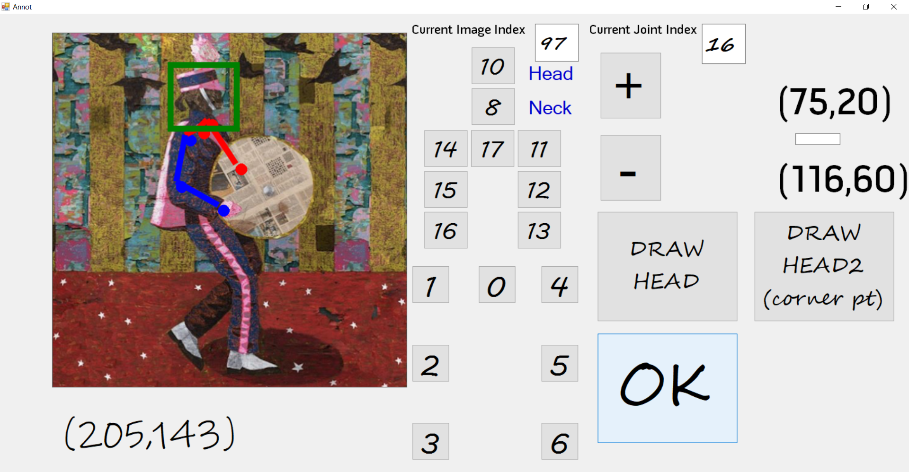

# Artistic Image Annotator

Written in C\#. Developed in Visual Studio 2019.


## Screenshot

<p align="center">  
  
</p> 

## Usage

1. ##### head bounding box #####
   Click **DRAW HEAD2 (corner pt)** once at left-top of head (```(bbx_x1, bbx_y1)```), click **DRAW HEAD2 (corner pt)** again at bottom-right of head (```(bbx_x2, bbx_y2)```), a **green** bounding box surrounding the head will appear.
2. ##### 2d keypoints #####
   Click the number **0-16** to indicate which joint to annotate, then click at the position of that joint. Some edges between consecutive (nearby) joints in the kinematic chain will show along the way. Edges related to left part of the body are in **red**, edges related to right part of the body are in **blue**.
*0: pelvis*
*1: right hip*
*2: right knee*
*3: right ankle*
*4: left hip*
*5: left knee*
*6: left ankle*
*8: neck*
*10: head*
*11: left shoulder*
*12: left elbow*
*13: left wrist*
*14: right shoulder*
*15: right elbow*
*16: right wrist*
*17: thorax*

3. ##### next image #####
   Press **+**
4. ##### previous image #####
   Press **-**
5. ##### navigate to arbitrary image #####
   Enter image index in the box **Current Image Index**, then hit *enter* 
6. ##### shift to any keypoint #####
   Similarly, enter joint index in the box **Current Joint Index**, then hit *enter*

