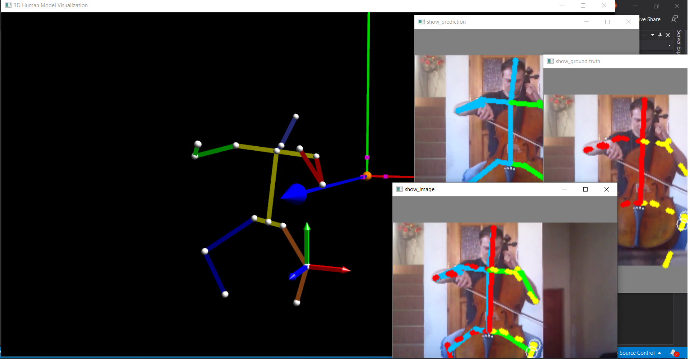
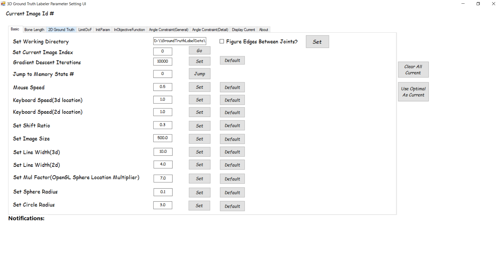

# MPII Annotator

## Report

A detailed report is in this pdf **2D Human Pose Dataset 3D Joint Location Ground Truth Annotation Tool Guideline**.

## Screenshots

##### 3D Keypoints Annotation Interface (OpenGL) #####


<p align="center">  
  
</p> 

##### Parameters Settings Interface (C\#) #####


<p align="center">  
  
</p> 


<p align="center">  
  
</p> 

## Environment

Developed in Visual Studio 2013. Compatible with Visual Studio 2019.

## Build

Download [Eigen](http://eigen.tuxfamily.org/index.php?title=Main_Page) and place under 

```
  annotation_tools/mpii_annotator/ThreeDGroundTruthLabeler/ThreeDGroundTruthLabeler/eigen/

```

Download tools (*freeglut-2.8.1*, *glew-1.10.0*, *glm-0.9.5.4*, *glm-0.9.5.4*, *opencv-3.0.0*) from [here](https://drive.google.com/drive/folders/15DUHqhOdsQfq6G6zGNMIWkwRGgjRVCNC?usp=sharing) and place under 


```
  annotation_tools/mpii_annotator/ThreeDGroundTruthLabeler/tools/*

```

Build the project *ThreeDGroundTruthLabeler* using *Release Win32* mode.

## Usage

1. ##### 3d annotation #####

	Used a forward kinematics human model with 2D reprojection error as an intial objective function to obatain a rough estimate of 3D keypoints that matche the 2D (given by MPII) ground truth of one frame.
	
	Let the user interact with keyboard and mouse to make minor changes to a specific keypoint, and visualize 3D in OpenGL; 2D in OpenCV. Provided real-time visualization to reflect up-to-date 3D keypoint location changes.
