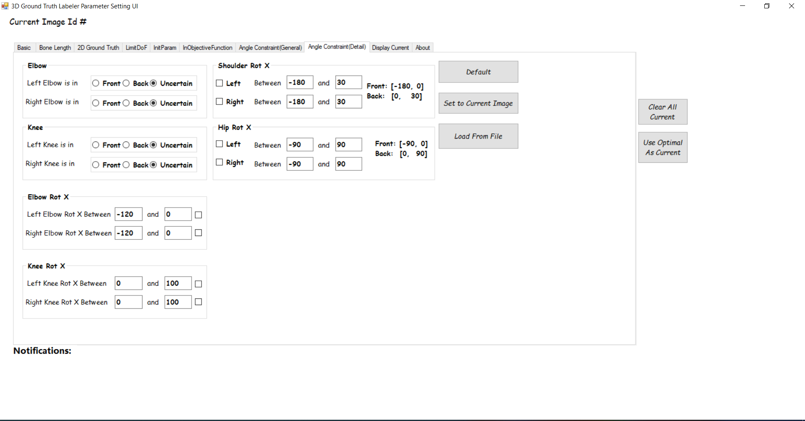

# MPII Annotator

## Report

A detailed report is in this pdf **2D Human Pose Dataset 3D Joint Location Ground Truth Annotation Tool Guideline**.

## Screenshots

##### 3D Keypoints Annotation Interface (OpenGL) #####


<p align="center">  
  
</p> 

##### Parameters Settings Interface (C\#) #####


<p align="center">  
  
</p> 


<p align="center">  
  
</p> 

## Environment

Developed in Visual Studio 2013. Compatible with Visual Studio 2019.

## Build

Download [Eigen](http://eigen.tuxfamily.org/index.php?title=Main_Page) and place under 

```
  annotation_tools/mpii_annotator/ThreeDGroundTruthLabeler/ThreeDGroundTruthLabeler/eigen/

```
