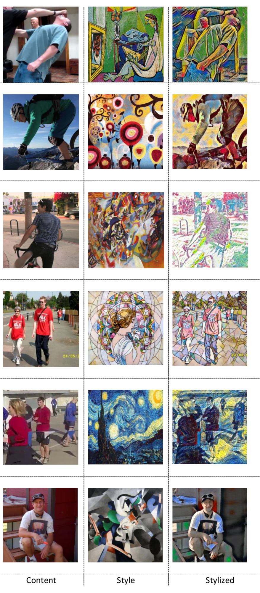

## Separate Training

In this page we show how to train individual style transfer models for each style.

We show the style transferred images on MPII below:

----

<p align="center">  
  
</p> 

----

We also show some failure cases. Note these styles are harder to learn.

----

<p align="center">  
  
</p> 

----

The full folder is uploaded [here](https://drive.google.com/drive/u/1/folders/1QOui2S330I63NPktygGJK2w_TBCdV-EI).

They are visually more entertaining than the ones in the joint-training pipeline. So if you want to see something pleasing, dig deeper into the folder above.

## Train
0. Download MPII dataset into /mpii/images
1. Train a style.
```
	python style_transfer.py
```
* More options:
	* `--content-weight`: change weight of content loss
	* `--style-weight`: change weight of style loss
	* `--style-path`: path to folder where styles are saved.
  * `--si`: designate style image.
	* `--cuda`: set if running on GPU.
2. Stylize a set of images on style.
```
	python stylize_image.py --w la_muse.jpg
```
* More options:
	* `--i`: select 1 image to stylize
	* `--s`: for s>0, sample s images from folder to stylize. Stylize entire folder if s==0
	* `--output-folder`: path to folder where output images will be saved
	* `--cuda`: set if running on GPU.
